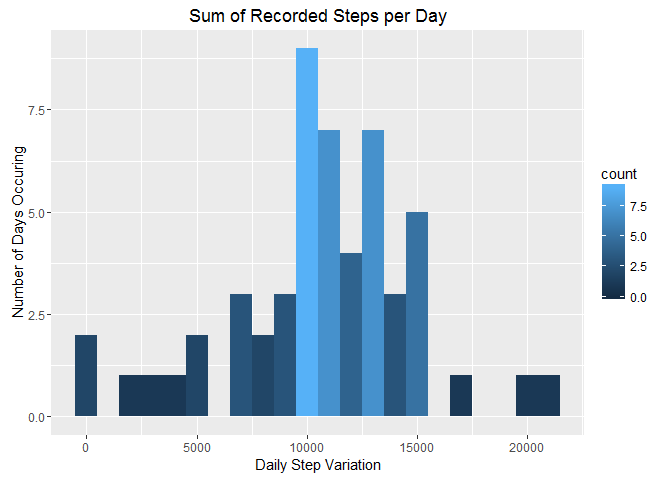
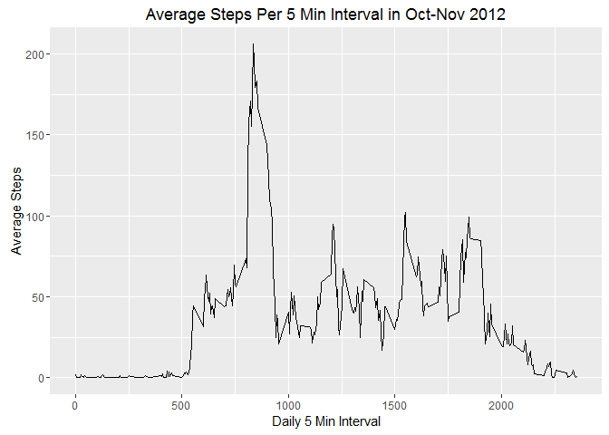
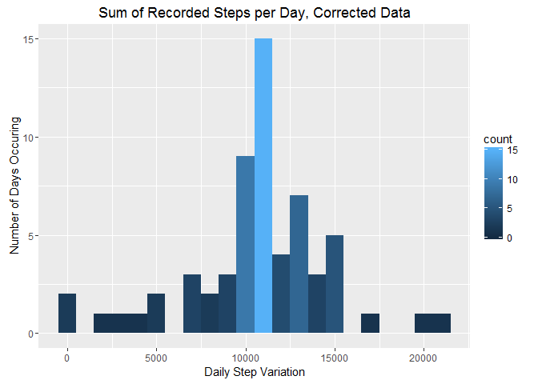
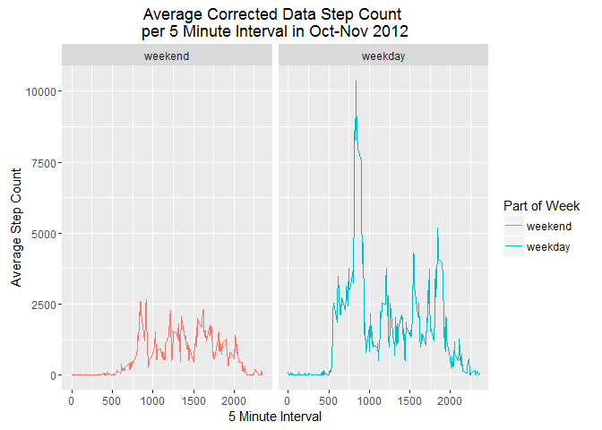

# Reproducible Research, Peer Assessment 1


## Assignment Overview

This assignment takes data of step counts, summed over 5-minute intervals, obtained from a activity monitoring device in October and November of 2012 and performs some basic analysis.  The original data set includes some missing ("NA") not available data points that are compensated for by using averaged values over the two months to replace the missing points. 

The assignment parameters include creating an R-markdown file of text and code that can be processed by [knitr](http://yihui.name/knitr/) to a single HTML output of with text, results and generated graphs. Code used to generate the results and graphs should be included in the final output. 

The output below will include a number of structure calls to check on the status and output of the modified data frames.  These are optional and could be deleted to reduce size of output length if desired. 

## Loading and preprocessing the data

*Assignment parameters: Show any code that is needed to
1. Load the data (i.e. read.csv())
2. Process/transform the data (if necessary) into a format suitable for your analysis*

The activity data file is available online.  The following code checks to see if the file is already available in the current working director, and if it isn't, it downloads and unzips the file before reading the produced activity data into a data frame . 
  

```r
# File Download
     fileURL <- "https://d396qusza40orc.cloudfront.net/repdata%2Fdata%2Factivity.zip"
          if (!file.exists("activity.zip")) {
               download.file(fileURL, destfile="activity.zip", mode="wb")
               unzip("activity.zip", exdir=".")
          }
# Reading data into usable data frame
     activity <- read.csv("activity.csv")
```
The file creates a data frame with the following parameters:

```r
     str(activity)
```

```
## 'data.frame':	17568 obs. of  3 variables:
##  $ steps   : int  NA NA NA NA NA NA NA NA NA NA ...
##  $ date    : Factor w/ 61 levels "2012-10-01","2012-10-02",..: 1 1 1 1 1 1 1 1 1 1 ...
##  $ interval: int  0 5 10 15 20 25 30 35 40 45 ...
```
The "steps" and "interval" columns are already integer class which is usable for calculations, but the 
date column needs to be processed to be recognized as a "Date" class for later use.  

```r
     activity$date <- as.Date(activity$date, format="%Y-%m-%d")
```
Repeating the earlier command to double-check the status, we can see that the class of the "date" column has been changed to "Date". 

```r
     str(activity)
```

```
## 'data.frame':	17568 obs. of  3 variables:
##  $ steps   : int  NA NA NA NA NA NA NA NA NA NA ...
##  $ date    : Date, format: "2012-10-01" "2012-10-01" ...
##  $ interval: int  0 5 10 15 20 25 30 35 40 45 ...
```

## What is mean total number of steps taken per day?

*Assignment parameters: For this part of the assignment, you can ignore the missing values in the data set.
1. Calculate the total number of steps taken per day
2. If you do not understand the difference between a histogram and a barplot, research the difference between them. Make a histogram of the total number of steps taken each day
3. Calculate and report the mean and median of the total number of steps taken per day* 

The activity data needs to be groups so that all the steps for a single day are added together.  The [dplyr](https://github.com/hadley/dplyr) is a nice package to group the data and perform the sum calculation on each grouped set.  The structure of the output is displayed, showing the original daily file includes some "NA" values.  


```r
     library(dplyr)
```

```
## 
## Attaching package: 'dplyr'
```

```
## The following objects are masked from 'package:stats':
## 
##     filter, lag
```

```
## The following objects are masked from 'package:base':
## 
##     intersect, setdiff, setequal, union
```

```r
     daily <- activity %>%              # creating new data set to not change original data frame
     group_by(date) %>%                 # all data for the same day grouped together
     summarise(dailystep = sum(steps))  # output will be a single summed step value per day
     
     str(daily)                         # display output structure
```

```
## Classes 'tbl_df', 'tbl' and 'data.frame':	61 obs. of  2 variables:
##  $ date     : Date, format: "2012-10-01" "2012-10-02" ...
##  $ dailystep: int  NA 126 11352 12116 13294 15420 11015 NA 12811 9900 ...
```

The package [ggplot2](http://docs.ggplot2.org/current/) will be used to produce the output graphs.  It is used initially to create a histogram of the daily step counts.  


```r
     library(ggplot2)
     p_hist <-ggplot(data=daily, aes(daily$dailystep))+          # basic setup
          geom_histogram(binwidth=1000, aes(fill=..count..)) +   # histogram type, 1000 step bins
          xlab("Daily Step Variation") +                         # set x-axis title
          ylab("Number of Days Occuring") +                      # set y-axis title
          ggtitle("Sum of Recorded Steps per Day")               # set main title
     print(p_hist)
```

```
## Warning: Removed 8 rows containing non-finite values (stat_bin).
```



In order to correctly calculate the daily mean and median values, the rows that contain "NA" values in the original data set are subsetted out, then the mean and median calculations are performed and the output is displayed. 


```r
     checkNAdaily <- is.na(daily$dailystep)
     if(sum(checkNAdaily)>1) {
          daily2<-filter(daily,!is.na(daily$dailystep))     # daily2 subset of daily w/o NA values
     }
     daily2Mean <- mean(daily2$dailystep); print(daily2Mean)          # creates, screen prints value
```

```
## [1] 10766.19
```

```r
     daily2Median <- median(daily2$dailystep); print(daily2Median)    # creates, screen prints value
```

```
## [1] 10765
```

We can see from the output that the daily mean step value of `{r daily2Mean}` is slightly higher than the daily median step value of `{r daily2Median}`. This does attempt to correct for any missing values. 

## What is the average daily activity pattern?

*Assignment parameters: 
1. Make a time series plot (i.e. type = "l") of the 5-minute interval (x-axis) and the average number of steps taken, averaged across all days (y-axis)
2. Which 5-minute interval, on average across all the days in the dataset, contains the maximum number of steps?*

We want to determine average values for each 5-minute interval over the course of the two months. This means instead of grouping by day, we want to group the original activity data frame by interval and then find the average value instead of the sum of the steps as previously done. The results are then graphed with a line type. The structure output of the new five minute grouped output is displayed. 


```r
     checkNA <- is.na(activity$steps)
     if(sum(checkNA)>1) {
          activity2<-filter(activity,!is.na(activity$steps))  # activity set w/o NA values
     }
     # Groups by interval, finds mean steps per interval
     fivemin <- activity2 %>% 
          group_by(interval) %>% 
          summarise(fiveminstep = mean(steps))
     str(fivemin)                            # displays output
```

```
## Classes 'tbl_df', 'tbl' and 'data.frame':	288 obs. of  2 variables:
##  $ interval   : int  0 5 10 15 20 25 30 35 40 45 ...
##  $ fiveminstep: num  1.717 0.3396 0.1321 0.1509 0.0755 ...
```

```r
     # Plot time series graph by interval
     p_interval <-ggplot(data=fivemin, aes(x=interval, y=fiveminstep))+     # basic
          geom_line() +                      # set line so can see gaps
          xlab("Daily 5 Min Interval") +     # set x-axis title
          ylab("Average Steps") +            # set y-axis title
          ggtitle("Average Steps Per 5 Min Interval in Oct-Nov 2012")  # set main title
     print(p_interval)
```


The 500-minute-interval where activity normally starts is roughly 8am, and the spike in average activity about the 800-minute-interval (roughly 1pm) may indicate a habitual noontime walk. 

The 5-minute interval with the maximum number of average steps can be found easily using:

```r
     maxinterval<-max(fivemin$fiveminstep); print(maxinterval)   # creates, screen prints value
```

```
## [1] 206.1698
```

## Imputing missing values

*Project Parameters: Note that there are a number of days/intervals where there are missing values (coded as NA). The presence of missing days may introduce bias into some calculations or summaries of the data.

1. Calculate and report the total number of missing values in the dataset (i.e. the total number of rows with NAs)
2. Devise a strategy for filling in all of the missing values in the dataset. The strategy does not need to be sophisticated. For example, you could use the mean/median for that day, or the mean for that 5-minute interval, etc.
3. Create a new dataset that is equal to the original dataset but with the missing data filled in.
4. Make a histogram of the total number of steps taken each day and Calculate and report the mean and median total number of steps taken per day. Do these values differ from the estimates from the first part of the assignment? What is the impact of imputing missing data on the estimates of the total daily number of steps?*

Previously, the logical vector "checkNA" was created that checked if the "activity$steps" had "NA" values and returned "TRUE" if "NA" and "FALSE" if a numerical value. Finding the number of "NA" values in the original set will then be a simple sum calculation. 

```r
     NAIntervals <- sum(checkNA); print(NAIntervals)    # creates, screen prints value
```

```
## [1] 2304
```

The strategy used to replace the missing 5-minute intervals is to use the average value for that 5-minute interval over the 2 months data was taken. This new data frame with the "NA" values replaced with averaged values was then grouped again by day and summarized by the sum of the total steps. A new column "newsteps" was created so that the rows with the original NA values could still be identified.

After the new values are created, the results are plotted again with a histogram (same setup as the first one). 

```r
     activity3 <-activity %>%
          mutate(checkNA=is.na(steps), newsteps=steps) %>%
          mutate(newsteps = replace(newsteps,which(is.na(newsteps)),fivemin$fiveminstep))
     
     daily3 <- activity3 %>%
          group_by(date) %>%
          summarise(dailystep = sum(newsteps))
     
     # create histogram of updated values
     p_hist_mod <-ggplot(data=daily3, aes(daily3$dailystep))+   # basic setup
          geom_histogram(binwidth=1000, aes(fill=..count..)) +  # histogram, 1000 step bins
          xlab("Daily Step Variation") +                        # set x-axis title
          ylab("Number of Days Occuring") +                     # set y-axis title
          ggtitle("Sum of Recorded Steps per Day, Corrected Data") # set main title
     print(p_hist_mod)
```



## Are there differences in activity patterns between weekdays and weekends?

*Project Parameters: For this part the weekdays() function may be of some help here. Use the dataset with the filled-in missing values for this part.

1. Create a new factor variable in the dataset with two levels -- "weekday" and "weekend" indicating whether a given date is a weekday or weekend day.
2. Make a panel plot containing a time series plot (i.e. type = "l") of the 5-minute interval (x-axis) and the average number of steps taken, averaged across all weekday days or weekend days (y-axis) (Edit: example plot removed.)*

In order to determine whether the step activity occurred on a weekday (Monday - Friday) or weekend (Saturday - Sunday), the base weekdays function was used to return the day of the week from the "date" Date column value.  The outputted values were factored out as suggested in this [Stackoverflow solution](http://stackoverflow.com/questions/28893193/creating-factor-variables-weekend-and-weekday-from-date). 

With a new column added to the previously created data set of corrected values, the results are re-grouped for daily values that include a column indicating if the value was for a weekday or weekend.  Results plotted with a line graph in two panels, one for each part of the week. 


```r
     # Determine what day of the week steps are occuring and factor weekdays 
     # from weekends, then create panel plot showing any variance.
     weekdays1 <- c('Monday', 'Tuesday', 'Wednesday', 'Thursday', 'Friday')
     activity3 <-activity3 %>% mutate(weekday=weekdays(date))
     activity3$weekday <- factor((weekdays(activity3$date) %in% weekdays1),
               levels=c(FALSE, TRUE), labels=c('weekend', 'weekday'))
     
     daily4 <- activity3 %>% group_by(interval,weekday) %>%
          summarise(dailystep = sum(newsteps))
     
     # Create panel plot of activity vs day of the week. 
     p_interval_mod <-ggplot(data=daily4, aes(x=interval, y=dailystep, group=weekday, 
               colour=weekday))+                        # group and colour by type of PM2.5 Emission
          geom_line() +                                 # outputs solid lines
          scale_colour_discrete(name="Part of Week") +  # set legend title (twice as two)
          xlab("5 Minute Interval") +                   # set x-axis title
          ylab("Average Step Count") +                  # set y-axis title
          ggtitle("Average Corrected Data Step Count \nper 5 Minute Interval in Oct-Nov 2012")  # set main title
     
     p_interval_mod <- p_interval_mod + facet_grid(.~weekday) # add facet grid type. 
     print(p_interval_mod)
```



As a general note, we can notice that the person wearing the activity monitor was more active on weekdays than on weekends. 
